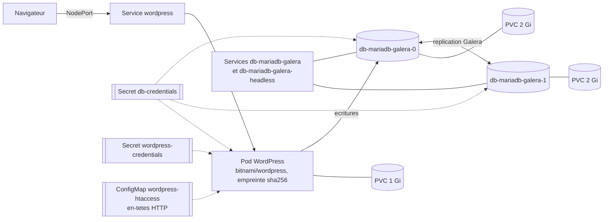

# Rapport de projet DevSecOps : reprise et securisation de wordpress-ha-s3

- Auteur : Robin Lautier
- Formation : CyberSup, M2 Cyber, Bloc 04 DevSecOps
- Date : 2026-10-08
- Depot : https://github.com/keepitsimpleandsecure/wordpress-ha-s3-devsecops
- Classification : TLP:CLEAR (aucune valeur secrete dans ce document)

Les secrets sont toujours designes par un nom entre chevrons, par exemple `<DB_PASSWORD>`. Les dates et heures sont en UTC (ISO 8601).

## 1. Contexte et perimetre

Une promotion precedente a construit un site WordPress qui tourne sur Kubernetes. Il s'appuie sur une base MariaDB Galera repliquee, installee avec les charts Helm de Bitnami. Le site fonctionnait, mais la securite n'avait pas ete traitee :

- des mots de passe et des cles d'acces etaient ecrits en clair dans le depot ;
- aucun controle automatique n'etait en place.

La mission etait de reprendre ce projet comme une equipe DevSecOps, en quatre temps :

1. le faire tourner ;
2. trouver et sortir les secrets ;
3. scanner et corriger ;
4. automatiser les controles.

**Perimetre.** Tout le travail a ete fait sur un cluster Minikube local, sans aucune connexion au cloud Azure du projet d'origine. La partie multi-cluster (Liqo, k8gb) et le deploiement Azure sont hors perimetre. Seuls leurs secrets et leurs manifestes ont ete traites.

**Environnement du labo.**

- machine : Debian 13, 4 vCPU, 7 Go de memoire ;
- outils : Minikube v1.39, Kubernetes v1.37, Helm v4.3 ;
- charts : `bitnami/mariadb-galera` 16.0.1 et `bitnami/wordpress` 34.1.3 ;
- scanners : gitleaks 8.30.1, Trivy 0.75.0, Checkov 3.3.26, Semgrep 1.180.0, ZAP baseline.

**Durcissement du labo.** La machine avait un mot de passe par defaut connu. Il a ete change (compte de service et root), la connexion SSH a ete limitee aux cles, et la connexion root a distance a ete interdite.

## 2. Ce qui tourne



Tout est deploye dans le namespace `wordpress` par `scripts/deployer.sh` :

- la base MariaDB Galera tourne sur deux noeuds qui se repliquent l'un l'autre ;
- WordPress lit ses mots de passe dans deux Secrets Kubernetes, generes au premier deploiement.

Etat verifie sur le labo :

- 3 pods prets ;
- page d'accueil en HTTP 200 ;
- `wsrep_cluster_size = 2` (deux noeuds dans le cluster Galera).

Deux ecarts au sujet ont ete necessaires.

**Les images du sujet n'existent plus.**

- Probleme : en 2025, Bitnami a retire de Docker Hub ses images versionnees gratuites. `bitnami/mariadb-galera:10.5` renvoie "introuvable", et les commandes du sujet echouent pour tout le monde.
- Risque : les copies archivees (`bitnamilegacy`) ne recoivent plus de correctifs.
- Solution : l'archive a servi de point de depart. Les images ont ensuite ete remplacees (voir section 4).

**WordPress echouait a s'installer sur deux noeuds Galera.**

- Probleme : avec deux noeuds, Galera fait avancer les identifiants de 2 en 2 pour eviter les collisions. L'administrateur WordPress recevait donc l'identifiant 2, alors que le script d'installation cherche l'utilisateur 1, et le conteneur s'arretait.
- Risque : le site ne demarre pas.
- Solution : WordPress n'ecrit que sur le noeud 0, et ce reglage automatique de Galera est desactive (`extraFlags` dans `db_values.yaml`). La donnee reste repliquee sur le noeud 1. Si le noeud 0 redemarre, le site revient des que le pod est pret (test realise).

## 3. Les secrets

### 3.1 Inventaire (caviarde)

Le ZIP fourni n'avait pas d'historique Git. Un depot "origine" a donc ete reconstitue en local. Il n'a jamais ete publie et n'a servi qu'a scanner l'etat initial.

`gitleaks` (mode `--redact`) y trouve **23 constats** (`rapports/gitleaks-origine-resume.txt`). Le jeton Liqo, les trois mots de passe de la base et de WordPress, et les identifiants Azure non secrets ont ete reperes a la main : gitleaks ne les reconnait pas.

| Secret | Fichier | Detection | Proprietaire qui doit agir |
|---|---|---|---|
| 2 secrets clients de principaux de service Azure (`<AZURE_CLIENT_SECRET_C1>`, `<AZURE_CLIENT_SECRET_C2>`) | `infra/provider.tf` | gitleaks (azure-ad-client-secret x2) | administrateur du tenant Azure de l'equipe d'origine |
| Identifiants client, tenant et abonnement des deux providers | `infra/provider.tf` | manuelle | idem (pas secrets en eux-memes, mais revelent le tenant) |
| 4 kubeconfigs (cles privees, certificats et jetons clients) | `liqo/config_dev-poc*`, `liqo/quick-start/liqo_kubeconf_dev-poc*` | gitleaks (private-key x12, generic-api-key x8) | administrateurs des clusters AKS |
| Jeton Liqo | `liqo/liqo-token` | manuelle | administrateurs du cluster |
| Cle du compte de stockage Azure (en commentaire) | `wp_values.yaml` | gitleaks (generic-api-key x1) | proprietaire du compte de stockage |
| Mots de passe root et applicatif de la base, mot de passe admin WordPress (`<DB_ROOT_PASSWORD>`, `<DB_PASSWORD>`, `<WP_ADMIN_PASSWORD>`) | `db_values.yaml`, `wp_values.yaml` | manuelle | equipe projet |

Le script `all.sh` contenait `az login -u -p`, sans valeur. Ce n'est pas une fuite, mais c'est une mauvaise pratique : un mot de passe passe en argument reste dans l'historique du shell. Le script utilise maintenant la connexion interactive.

### 3.2 Plan de revocation

L'ordre suit celui du cours : revoquer, faire la rotation, sortir du code, purger.

1. **Revoquer.**
   - Secrets Azure : supprimer les deux secrets clients dans Entra ID (Inscriptions d'applications, Certificats et secrets).
   - Kubeconfigs : faire la rotation des certificats des clusters AKS (`az aks rotate-certs`), ce qui invalide les kubeconfigs fuites.
   - Liqo : supprimer le jeton du compte de service `liqo-auth`.
   - Stockage : regenerer les deux cles du compte. La revocation de la cle exposee a ete confirmee le 2026-10-07 (action du proprietaire du compte, hors du labo).
2. **Rotation.**
   - Creer de nouveaux secrets Azure, fournis uniquement par variables d'environnement (`ARM_CLIENT_ID`, `ARM_CLIENT_SECRET`, `ARM_TENANT_ID`, `ARM_SUBSCRIPTION_ID`).
   - Les mots de passe de la base et de WordPress sont regeneres aleatoirement a chaque nouvel environnement par `scripts/creer-secrets.sh`. Ils ne sont jamais affiches ni ecrits sur disque, et le script ne les remplace pas si le Secret existe deja.
3. **Sortir du code.**
   - `infra/provider.tf` ne contient plus aucun identifiant.
   - Les values referencent `existingSecret`.
   - Les kubeconfigs et le jeton sont supprimes.
   - `.gitignore` bloque `.env`, kubeconfigs, jetons, `*.tfvars` et etats Terraform.
4. **Purger.** Republier des secrets compromis est interdit. Le depot publie part donc d'un premier commit deja nettoye. Les valeurs de l'historique d'origine n'ont jamais ete poussees.

Un detecteur maison compare chaque valeur secrete du ZIP a tout le contenu du depot publie, objets Git compris. Il trouve **0 occurrence**, et `gitleaks git` sur l'historique publie ne trouve aucune fuite.

### 3.3 Hook pre-commit

`.pre-commit-config.yaml` installe gitleaks (v8.30.1) avant chaque commit.

Test : sur une branche jetable, un faux jeton GitHub genere au hasard a ete commite. Le commit a ete refuse (regle `github-pat`, `leaks found: 1`). La preuve est dans `rapports/preuve-hook.txt`, avec le faux jeton remplace par un marqueur. Le faux secret n'a jamais ete commite.

## 4. Top 5 des problemes et corrections

Les scans initiaux sont dans `rapports/*-avant.txt` et les scans apres corrections dans `rapports/*-apres.txt`. Les problemes ont ete classes selon le triage du cours : gravite, correctif disponible, exposition.

| # | Outil | Fichier ou cible | Gravite | En clair | Correction (commit) |
|---|---|---|---|---|---|
| 1 | gitleaks | `infra/provider.tf`, `liqo/`, values | Critique | Des acces Azure et Kubernetes complets etaient publics | Secrets retires avant publication, plan de revocation (section 3) |
| 2 | Trivy image | `bitnamilegacy/wordpress` | 78 CRITICAL, 430 HIGH | L'image archivee n'est plus mise a jour : failles connues dans PHP, Apache et le systeme | Image Bitnami a jour, epinglee par empreinte sha256 (`e2d9ce1`) |
| 3 | Trivy image | `bitnamilegacy/mariadb-galera` | 20 CRITICAL, dont 18 avec correctif | Les correctifs Debian existent, mais l'image n'est plus reconstruite | Image reconstruite avec toutes les mises a jour de securite Debian (`images/mariadb-galera/Dockerfile`, `55fdb1e`, completee lors de la revue finale) |
| 4 | Trivy config (KSV-0111) | `liqo/liqo-auth-service-account.yaml` | Moyenne | Le compte Liqo avait tous les droits sur le cluster (`cluster-admin`) | Role dedie en lecture seule, jeton non monte automatiquement (`e39147c`) ; droits supposes suffisants, non teste (Liqo hors perimetre) |
| 5 | Checkov (CKV_K8S_21 x8), Semgrep (x6), Trivy (KSV-0118) | values, manifestes de demo Liqo | Faible a haute | Tout etait deploye dans `default`, et les pods de demo tournaient en root sans limites | Namespace dedie `wordpress` (`7dec521`), demo durcie (`1189837`), empreintes et `pull Always` (`e2d9ce1`) |

Chaque correction a ete prouvee de deux facons : par un nouveau scan, et par un redeploiement sur le labo (3 pods prets, HTTP 200, administrateur toujours a l'identifiant 1).

| Scan | Avant | Apres |
|---|---|---|
| Trivy image WordPress | CRITICAL 78, HIGH 430 | CRITICAL 0, HIGH 0 |
| Trivy image Galera | CRITICAL 20, HIGH 184 | CRITICAL 2, HIGH 124 |
| Trivy config (manifestes WordPress et Galera) | CRITICAL 0, HIGH 0 | CRITICAL 0, HIGH 0 |
| Trivy config (manifestes Liqo) | HIGH 7, MEDIUM 13, LOW 23 | HIGH 0, MEDIUM 2, LOW 5 |
| Checkov WordPress et Galera (echecs) | 14 | 0 |
| Checkov Liqo (echecs) | 48 | 14 |
| Semgrep (constats) | 6 | 0 |

Les rapports correspondants sont dans `rapports/` (`*-avant.txt`, `*-apres.txt`, `*-liqo-*.txt`) et le detail des compteurs dans `rapports/compteurs.md`.

- **Manifestes WordPress et Galera.** Trivy config etait deja a 0 HIGH et CRITICAL avant les corrections : les charts Bitnami appliquent par defaut un utilisateur non root, un profil seccomp et le retrait des capacites. Les corrections ont porte sur ce que Checkov signalait (namespace, empreintes).
- **Image Galera.** Toutes les failles Debian qui ont un correctif sont corrigees (23 HIGH de plus lors de la revue finale). Restent 2 CRITICAL et 82 HIGH Debian sans correctif publie, et 42 lignes HIGH dans le binaire Go `ini-file` fourni par Bitnami : 21 failles comptees deux fois (binaire et fichier SPDX), corrigees dans Go mais pas dans ce binaire, que Bitnami ne reconstruit plus.
- **Liqo.** Les 14 echecs Checkov restants concernent la demo hors deploiement : 10 portent sur le patch Kustomize du frontend, que Checkov lit seul sans le manifeste distant qu'il complete.

**Constats acceptes.** Chacun a une raison et une date de revue (2026-11-08).

- **CVE-2025-68121 (Go)** dans un utilitaire compile par Bitnami dans l'image Galera. Il est impossible de la corriger par une mise a jour du systeme. L'utilitaire ne sert qu'au demarrage et n'expose aucun service reseau (`.trivyignore`).
- **CKV_K8S_40 (UID eleve)** sur Galera et WordPress. Les images Bitnami sont prevues pour l'UID 1001, et les volumes de Minikube n'appliquent pas `fsGroup` (annotation dans les values).
- **CKV_K8S_43 et CKV_K8S_15 (empreinte, pull Always)** sur Galera. L'image corrigee est construite dans Minikube par `scripts/deployer.sh`, sans registre. Son nom commence par `localhost/` et `pullPolicy` vaut `Never` : elle n'est jamais telechargee depuis un registre public. Sa base est epinglee par empreinte dans le Dockerfile.

## 5. Pipeline CI et test dynamique (DAST)

### 5.1 Workflow `securite.yml`

Il s'execute a chaque push et sur chaque PR vers `main`. Il comprend quatre controles :

- `gitleaks` : tout l'historique Git ;
- `trivy-config` : manifestes generes par `helm template`, demo Liqo et Dockerfile ;
- `checkov` : Terraform et manifestes (le dossier `infra/` ne contient aujourd'hui que la declaration du provider, sans ressource : Checkov n'y trouve rien a controler) ;
- `trivy-image` : image WordPress par empreinte, et image Galera reconstruite dans la CI a partir du Dockerfile. Ce controle bloque sur les failles critiques qui ont un correctif.

Les versions et les actions sont epinglees (actions par empreinte de commit). Aucun controle n'est tolere en echec.

La branche `main` est protegee :

- pas de push direct (un essai a ete refuse par GitHub) ;
- fusion uniquement par PR, avec les quatre controles verts ;
- regle appliquee aussi a l'administrateur.

### 5.2 Rouge puis vert

La PR #1 introduit volontairement une vraie mauvaise configuration : le conteneur WordPress est autorise a tourner en root, avec escalade de privileges.

- **Rouge :** Checkov la bloque (CKV_K8S_20 et CKV_K8S_23), et la fusion est impossible. Execution : https://github.com/keepitsimpleandsecure/wordpress-ha-s3-devsecops/actions/runs/37772778788
- **Vert :** apres le retour a la configuration durcie, les quatre controles passent et la PR est fusionnee. Execution : https://github.com/keepitsimpleandsecure/wordpress-ha-s3-devsecops/actions/runs/37772991062

Le pipeline a aussi prouve son utilite sans mise en scene. Sur la PR #3, une ConfigMap ajoutee sans namespace a ete bloquee par Checkov (CKV_K8S_21) : c'est un retour accidentel vers `default`, que la correction 5 avait supprime. L'oubli a ete corrige avant la fusion.

### 5.3 ZAP baseline et ticket

Le scan ZAP baseline (`zaproxy/zap-stable@sha256:781a2bd...`) a ete lance contre le WordPress local, via `kubectl port-forward`. Il remonte 17 avertissements, aucun bloquant. Deux concernent des en-tetes HTTP absents :

- `Missing Anti-clickjacking Header` (moyenne) : sans lui, le site peut etre affiche dans une page piegee ;
- `X-Content-Type-Options Header Missing` (faible) : sans lui, le navigateur peut mal interpreter un fichier.

Le ticket https://github.com/keepitsimpleandsecure/wordpress-ha-s3-devsecops/issues/2 a ete ouvert au format du cours : gravite, preuve, correction attendue, responsable et date, critere de fermeture.

La correction (PR #3) charge au demarrage d'Apache une ConfigMap qui ajoute :

- `X-Content-Type-Options: nosniff` ;
- `X-Frame-Options: SAMEORIGIN` ;
- `Referrer-Policy: strict-origin-when-cross-origin`.

Ce mecanisme desactive la lecture des fichiers `.htaccess` (verifie sur le labo : `AllowOverride None` dans les vhosts Apache, qui incluent la ConfigMap). Les regles du seul `.htaccess` present (plugin Akismet) ont donc ete reprises : l'acces direct au PHP du plugin renvoie toujours 403.

Le second scan (`rapports/zap-apres.html`) ne remonte plus les deux alertes : 15 avertissements au lieu de 17, et 52 controles reussis au lieu de 50. Le ticket a ete ferme en citant ce scan.

## 6. Limites et suite

- **Image Galera.** Elle reste une archive reconstruite localement : 2 CRITICAL et 82 HIGH Debian sans correctif publie, plus 21 failles HIGH dans le binaire Go de Bitnami. En production, il faudrait une source d'images maintenue (abonnement Bitnami, image construite et signee par l'equipe, ou image officielle MariaDB avec un autre mode de deploiement), publiee dans un registre prive et epinglee par empreinte.
- **Un seul noeud ecrivain.** Si le noeud Galera 0 est indisponible, WordPress attend son redemarrage. Il serait mieux de passer par un proxy SQL (ProxySQL, MaxScale) qui bascule automatiquement.
- **Alertes ZAP restantes.** Pas de politique CSP, et pas de jeton anti-CSRF sur certains formulaires. Ce sont les prochaines corrections : une CSP adaptee aux scripts de WordPress, puis un nouveau scan.
- **Labo.** Le groupe `docker` donne en pratique les droits root sur la machine. C'est un risque accepte pour un labo individuel.
- **Revocation.** Les anciens secrets doivent etre revoques par leurs proprietaires (equipe d'origine, administrateurs Azure et AKS) selon le plan de la section 3.2. Seule la revocation de la cle de stockage est confirmee (2026-10-07).
- **Documentation d'origine.** Les 47 captures d'ecran du README d'origine, hebergees dans le depot de l'equipe precedente, ont ete retirees : certaines montrent des fichiers de configuration (kubeconfig) et ne pouvaient pas etre verifiees sans risque de recopier un secret.
- **Bonus.** La phase "Surveiller et reagir" (regle Wazuh, cas TheHive, fiche de reponse) reste a realiser avec les acces a la plateforme SOC du formateur.

## Annexe : reproduire

```bash
minikube start --cpus=4 --memory=5500mb
./scripts/deployer.sh   # construit aussi l'image Galera corrigee si elle manque
minikube service -n wordpress wordpress --url
./scripts/rendre-manifestes.sh && trivy config rendu && checkov -d rendu --framework kubernetes --config-file .checkov.yaml
```
